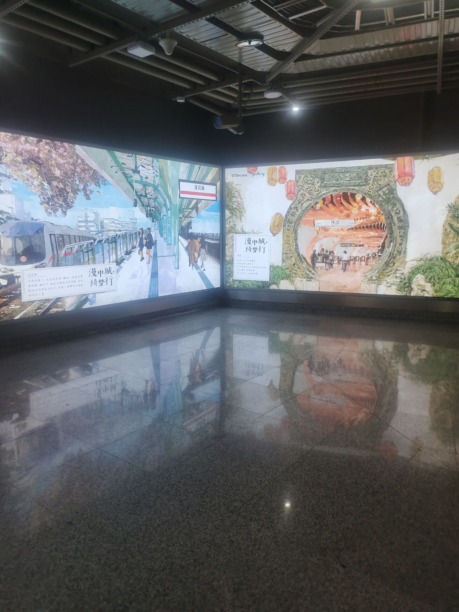
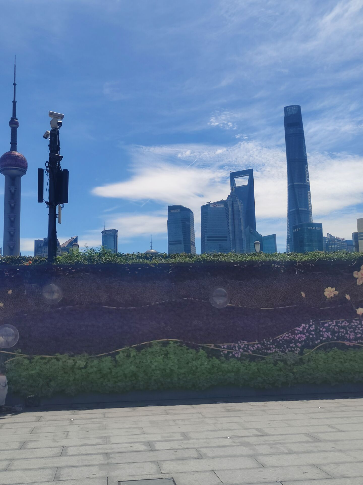

####  上海

上海是很有希望的一个城市，我去之前是这样的，后来我发现，上海没有我想象的嫩么好，我住在徐汇区，北科大厦，租了一个十人间的房子，虽然是十人间，但是好在是胶囊房，里面有一个床帘，每个房子都有。这个房东是个好人，让我住，不查房，非常信任他人的一个好人。而且也没有多要我的房租，其实我还多住了半天。

房东的名字叫温馨的家，确实令我感到温馨。

我在这个宿舍呆了多数时间，这个地方很温馨，我以为会碰见什么坏事，其实没有，我以为有恶霸室友，但没有，挺好的。房租是四十一天，还好。

这是内部构造，我的生活是吃的很少，一天可能就吃一两顿饭，早上一顿，晚上一顿，买个饼之类的，这段日子有点像苦修，什么也没有，没有网，流量不够，出来也是花钱，就一个人在那，也没有朋友，开始我的修行吧，我感觉到了精气神合一的美妙，这无疑是美妙的。

上海的主流交通工具是地铁和公交，上海的地铁干净漂亮，感觉很好，我偶尔碰见了一些外国人，我仔细观察，发现黑人居多，黑人的眼睫毛很长，感觉很有魅力，不管男女，是的，黑人别有一番风味。

上海的女生大多化妆不多，喜欢淡妆，感觉没有开封的一些女生漂亮。但是上海的女生非常高傲，尤其是一些本地人，心气非常高，下面我举两个例子。

第一个是一个保洁阿姨，她捡了一些垃圾在楼道，挡着一个外卖员了，然后外卖员提了一下垃圾，被保洁阿姨看见了，她跟疯了一样，拽着那个外卖员，大声的骂他，我们在宿舍都听见了，真的，我们当时都以为是什么大事，其实就是一个小事，但是她人跟疯了一样。

还有一个事是我去应聘保安，那个面试女的全程玩手机回信息，说话故意压很低，而且她的思想非常负面，认为当保安的都是一些好吃懒作的人，就是问为什么不干其他的职业，而且态度非常不好，整个人思想非常阴暗，我向他打听了一下地址，她给了我一个字条，但是字迹不清，我追问了两句，她没有回答，最后一怒之下把字条撕了，而且还说，你不就是想让我发位置给你吗？这个女生的思想阴暗，上海的某些女生，真的不敢恭维，思想阴暗，长此以往，就是鬼态，短命之相。

上述两例说明上海某些女生自尊心极强，可能是看小说电视剧多了，以为自己生下来就是上海的人上人了，但是上海的经济满足不了他们所有人的欲望。

### 上海的总体感受

上海其实差不多算是中国最好的城市，事实是，上海目前的工作只有销售岗是招人的，其他岗位大多数是骗子。想不到上海居然嫩么多的骗子，少则二百，多则几千，上海给人的感觉太恐怖了，不像是一个一线城市，上海的感觉并不舒服，总体上来说。

### 最后的旅行

这是陆家嘴，外滩，我很开心，一路上我都碰见了许多和我一样流浪上海的独闯这，最后我约了一个半路上认识的朋友，一块去了陆家嘴，他本意是找工作，但是他也找了很多，一无所获，但是我告诉他，我们要多拍照片，既然来了，就去玩玩吧，我在离开上海的最后一天去了外滩，虽然没有什么玩的，但是心情很好。周围有大量的欧美风格建筑。

其他细节后续有时间补充。
