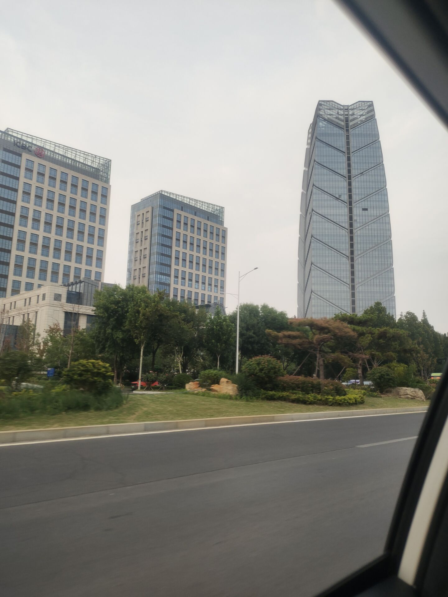

####  胖东来

昨天去新乡了，从开封出发，一家人坐在一辆车里面，有一种温馨感，途径黄河，看着森林和河流，我感觉里面一定有什么见不得人的东西。听说某个朋友在路过的黄河里面 抓过一只脸盆一样大的乌龟，不敢杀，不敢卖，怕他成精，报复。黄河旁边有大片的农业区，金黄的麦（具体是不是麦子不清楚）浪，草地，还有树林，一望无际，单单从外观上看，也许是美好的，但是农田里面，有一股粪臭味，很浓烈，化肥味很重，而且农田里面有很多奇怪的东西，甚至有铁塔，有一些可能是庙的奇怪建筑，反正当一个人真正亲近自然的时候，就发现，自然的力量是恐怖的，让人感觉这里面绝对住着什么恐怖的生物存在，整个场景，有点像电影千与千寻中他们途径的树林一样，除此之外，树林里面还有巨大的风力发电机，巨大的扇叶和农林风光不匹配，但是也别有一股奇观，让人感觉很壮观，令人敬畏，可能是什么外星的机器或者是上帝的玩具。树林里面还有一些人在放牛，牛的眼睛和人很像，当牛看你的时候，好像也在说什么，想什么。

途径药店，买了一些药，喝了中药店里面免费的茶，那个古法酸梅汤，说实话不好喝，但是那个中药红茶，味道可以，刮了一张彩票，没中。

最后到了胖东来（二胖），人很多，但是不挤，可能是热度过了，听说我姐第一次来人很多，吃饭都没有位置，胖东来的装修风格居然是黑色为主调，非常现代化，服务员据说工资八千，颜值也高，像是高学历人才。

胖东来并不便宜，东西买了，回来吃起来，感觉很干净，不虚假，炸的东西没有炸焦的地方，这一点我很满意。吃起来也很好，鱼没有刺（只有一根很大的独刺，而是独刺也不硬，可能是一种特殊的鱼）很细心，怕大家卡着鱼刺。最后在胖东来吃了一些饭，他的饭很干净，味道并不出彩，但是给人一种非常干净，规矩的食材。我们买了很多吃的，那个猪蹄，骨头全部去了，就一块肉摆在盘子里，隔着玻璃，没有一个苍蝇蚊子，那个虾，也是晶莹剔透。可惜都很贵，没钱买。买了一些便宜的豆腐，炸鱼，炸鸡，炸的非常干净，没有杂质，炸的也均匀，口感适中。

最后去三楼吃了一些其他饭，混沌，也很干净，麻辣烫，也很干净，这个干净是从里到外的，那个碗筷，也不是什么包浆的碗筷，干净的很，普通的食材，看起来很好。

最后从新乡回来，发现新乡的建筑符合现代风格，大气有格局，很壮观。

回来途径高速路，有一个摩托车在里面，开的飞快，各种穿插超车，看着惊心动魄。

最后到家了，车门没关，剐蹭了一点，刚开门，一只猫冲进了我的屋子。

最后结束今天的旅程。照片如下

### 手相

 好像是前天半夜，我给那看了一下自己手相，一个是川掌，川掌的人无依无靠，独立性强，能力强，但是有一个重要缺点，崇拜自己，自我中心，主要靠自己，不能靠别人，但是我的另一只手不是川掌了，事业线向水星丘发展。这个是从先天到后天，心态转变，明白自己单干不行，而且另一只手表现出谨慎吝啬的特征，转向了新的保守战略，我看手相看了很久，还在夜里，看得有点痴迷。

### 女生心理学

女生很执着，我身边的很多女生都出现一些共同的特征，就是执着，只信一个理，女生会遵循某个信条，非常执着，这是一种信仰，比如说每天必须洗脸刷牙，必须清洁什么，必须去哪，吃饭必须吃什么，不吃什么，并且长久的遵守这个原则。仙女的相亲条件，就是老了，也不能变。

但是男生不一样了，很多事情可以凑合，可以退步，算了也行，就这吧。

### 红楼梦

红楼梦真的很好，里面涉及很多宗教的东西，包含了大量的隐喻，有利于提高自己的算命水平，以贾宝玉为例，谐音，假宝玉，意思是不真实的，不宝贵的玉，林黛玉，谐音林贷玉，或者林代玉，都暗指了她不可能真的拥有一块“玉”，贾雨村，谐音愚蠢，干了很多搬石头砸自己的事情。

红楼梦，值得细读里面的隐喻。

### 做梦

我现在的梦，越来越清晰了，就是在梦中，我的思维很清晰，然后我梦中有人给我耳边不停的说话，告诉我做什么什么，但是我还是努力挣扎醒了，结果发现自己身上没有被子，如果没有醒，第二天咳嗽，但是还是有一点点咳嗽。

以后我的文章遵循大更制，字多，更新慢，方便服务器维护。

