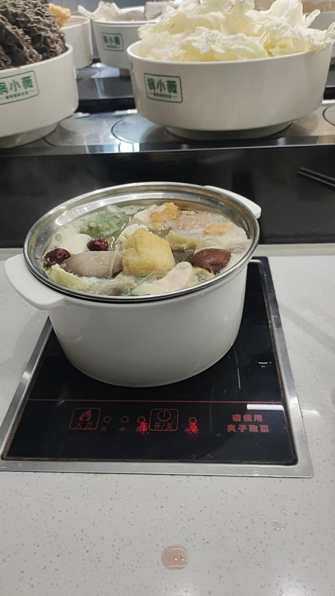

####  今天吃了一顿火锅

今天吃了一顿火锅，那个火锅在星光天地的负一层，B馆，永辉超市的旁边，自助的，有很多菜，一个人32元，想不到还有炸的食品，还有骨肉相连，还有那个炸的肉串和烤串，虽然肉可能不是什么好肉？？？都是冻品？但是真的很不错，很多很多菜品，还有几个荤菜，有什么鱿鱼？鸡肉卷？还有我最喜欢吃的脑子类，脑子是真的香滑。吃起来很软，很嫩，很好吃（一人32）。

前几天我哥请我吃了一个重庆火锅，那个重庆火锅也不错，重庆火锅没有芝麻酱。有醋，用汤汁当蘸水，那个是真的辣，辣的头晕脑涨，但是很爽，我哥喜欢吃那种高油高盐高价的东西，总体来说还是还行（一人70）。

今天碰见我的同学了，那个什么同学回来了，进了一个厂，看见送进医院的大约有六人，活过来的几人，不明？？？

反正他进厂回来，额头流血，嘴流血，鼻子也流血，像是干的了。跟打仗回来一样，感觉是上火了。不过我今天玩了他的苹果平板，那个画画功能真是不错，很真实！！！那个触控笔很好！！！
